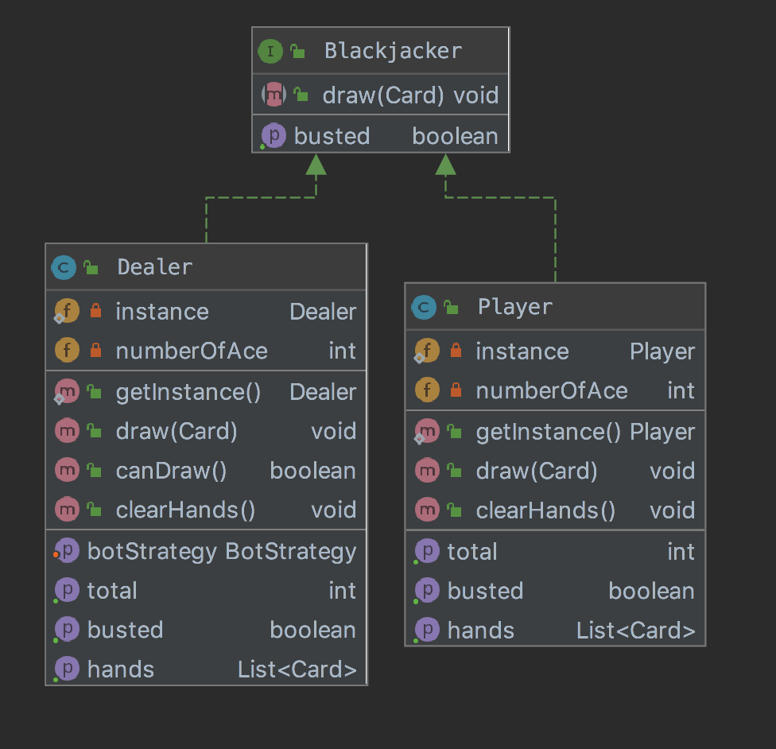
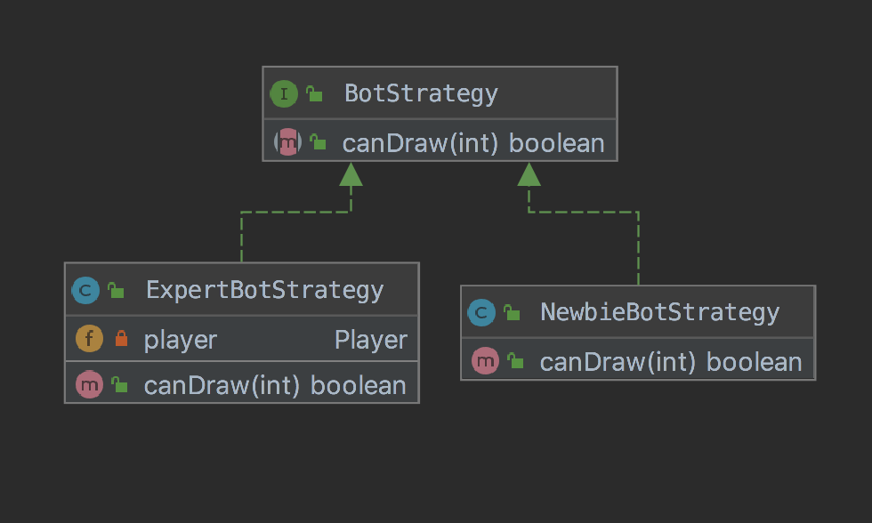
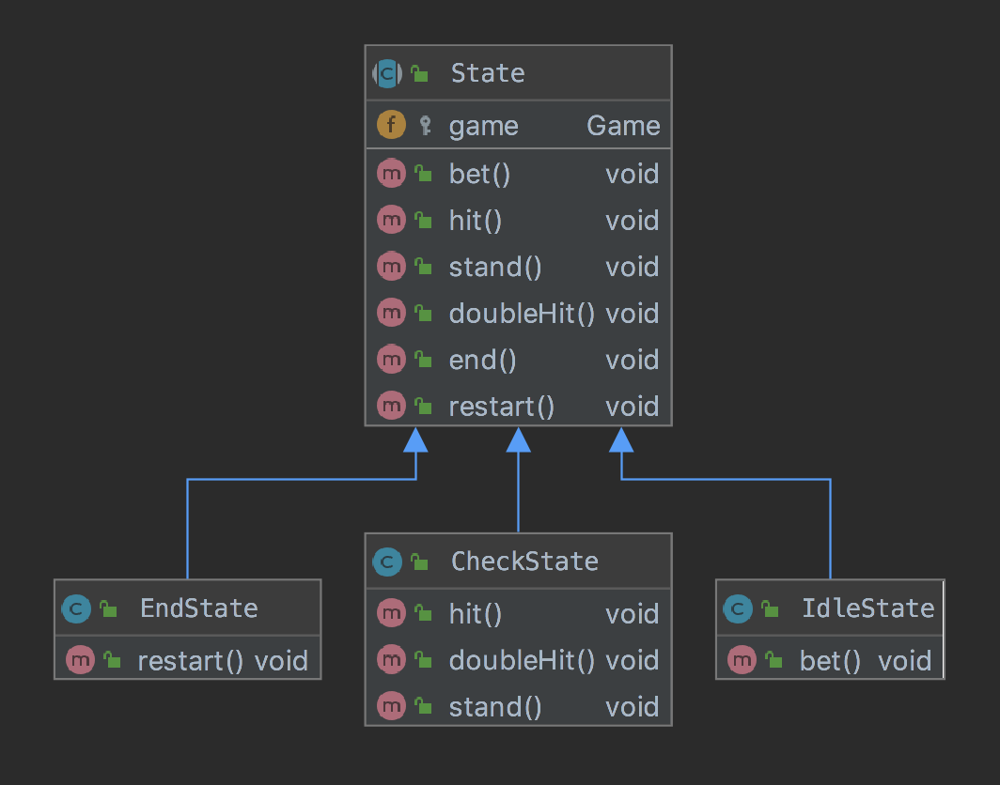

# Blackjack Game(Card game)
---

## Instruction
                This is card game called blackjack(21), The rule is who get the most points 
          but not over than 21 is the winner.
### Steps
    1. Bet your money.
    2. Dealer will deal you 2 card and 1 for himself.
    3. You choose what you want to do next
       * Hit - draw a card, you can draw until satisfied.
       * Double - draw only one card and double your bet.
       * Stand - if you satisfied with your points in hand, dealer will play his turn.
    4. If you win, you get your bet. If you lose, you lose your bet.  

### Rules
    1. If you have more than 21 points, you busted and lose immediately.
    2. You can have maximum 10 cards in your hands.
    3. Ace card can be both 1 or 11 points(Ex. if you have less than or equals 10, Ace will be 11)

## Development
### Design Pattern

####Singleton Design Pattern

   

 - I use singleton in player and dealer class because i want to save value for using in other class so i didn't invoke a new one.
 
---
####Strategy Design Pattern
   
     
 - I use strategy pattern for bot(dealer) with different logic so user can change level of bot if they want.
 
---
####State Design Pattern
   
     
 - I use state for controlling state of game. I decide to seperate it to several state such as IdleState, CheckState and EndState following state in the game.
 
---